  

  

  
  

  

---

<table>
  <tr>
    <td valign="top" width="50%">
      <h3>👨‍💻 About Me</h3>
      

        I am a <b>Full Stack Developer</b> and <b>DevOps Engineer</b> focused on creating seamless development workflows and robust web architecture. I specialize in the <b>MERN stack</b> for application logic and <b>OCI/AWS</b> for cloud infrastructure.
      

      <ul>
        <li>🔭 Working on: <b>Microservices & CI/CD Pipelines</b></li>
        <li>🌱 Learning: <b>Advanced OCI Architecture & Terraform</b></li>
        <li>💬 Ask me about: <b>React, Node.js, Java, K8s, Docker</b></li>
        <li>📫 Email: <a href="mailto:rambaghel741791@gmail.com">rambaghel741791@gmail.com</a></li>
      </ul>
       
      <h3>📫 Connect with me</h3>
      

        
        
      

    </td>
    <td valign="top" width="50%">
      <h3>🛠️ Tech Stack</h3>
      

        
          
        
          
        
      

    </td>
  </tr>
</table>

---

  <h3>📊 GitHub Analytics</h3>

  <h3>Profile Views</h3>
  
    

  

    
  

  

    
  

  

    
  

 
 

  

 

